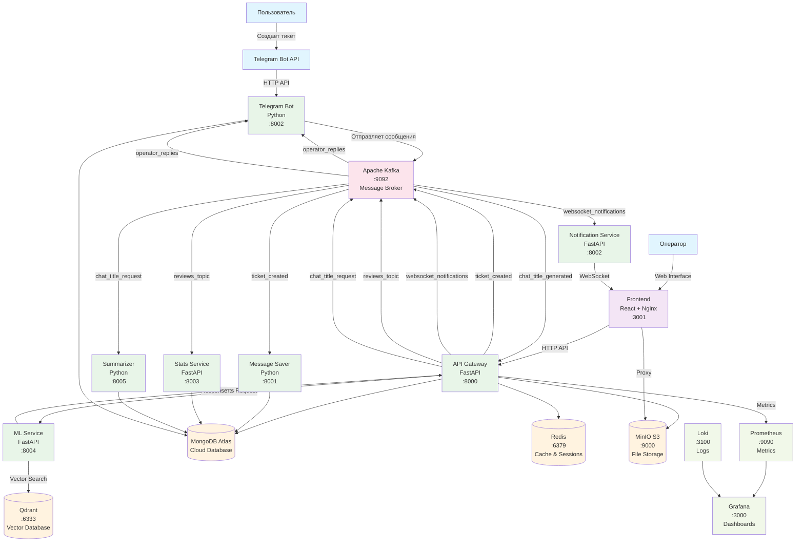

# Архитектура системы техподдержки T1

## Диаграмма взаимодействия микросервисов

## Kafka Topics и их назначение

### 1. **ticket_created** 
- **Назначение**: Новые сообщения от пользователей
- **Producer**: API Gateway
- **Consumer**: Message Saver
- **Содержит**: Сообщения, фото, метаданные

### 2. **operator_replies**
- **Назначение**: Ответы операторов пользователям
- **Producer**: API Gateway  
- **Consumer**: Telegram Bot
- **Содержит**: Ответы операторов для отправки в Telegram

### 3. **websocket_notifications**
- **Назначение**: Уведомления для WebSocket
- **Producer**: API Gateway
- **Consumer**: Notification Service
- **Содержит**: События для уведомления операторов в реальном времени

### 4. **reviews_topic**
- **Назначение**: Отзывы и рейтинги
- **Producer**: API Gateway
- **Consumer**: Stats Service
- **Содержит**: Рейтинги, комментарии, статистика операторов

### 5. **chat_title_request**
- **Назначение**: Запросы на генерацию названий чатов
- **Producer**: API Gateway
- **Consumer**: Summarizer
- **Содержит**: Первые сообщения для генерации названий

### 6. **chat_title_generated**
- **Назначение**: Сгенерированные названия чатов
- **Producer**: Summarizer
- **Consumer**: API Gateway
- **Содержит**: Готовые названия чатов

### 7. **ocr_processed**
- **Назначение**: Результаты OCR обработки
- **Producer**: Message Saver
- **Consumer**: API Gateway
- **Содержит**: Распознанный текст с изображений

## Ключевые взаимодействия

### 1. **Обработка сообщения пользователя**:
1. Пользователь отправляет сообщение в Telegram
2. Bot получает сообщение и отправляет в API
3. API сохраняет в MongoDB и отправляет в Kafka (topic: `ticket_created`)
4. Message Saver обрабатывает и сохраняет в MongoDB
5. API отправляет уведомление в Kafka (topic: `websocket_notifications`)
6. Notification Service получает и отправляет WebSocket уведомление оператору

### 2. **Ответ оператора**:
1. Оператор отвечает через Frontend
2. API сохраняет ответ в MongoDB
3. API отправляет в Kafka (topic: `operator_replies`)
4. Bot получает и отправляет ответ пользователю в Telegram

### 3. **AI подсказки**:
1. Оператор запрашивает подсказки через Frontend
2. API отправляет запрос в ML Service
3. ML Service ищет в Qdrant векторной базе
4. ML Service возвращает подсказки в API
5. API возвращает подсказки оператору

### 4. **Генерация названий**:
1. При создании первого сообщения API отправляет в Kafka (topic: `chat_title_request`)
2. Summarizer получает запрос и генерирует название через OpenRouter API
3. Summarizer отправляет результат в Kafka (topic: `chat_title_generated`)
4. API получает название и обновляет чат в MongoDB

### 5. **Статистика и рейтинги**:
1. При закрытии тикета API отправляет рейтинг в Kafka (topic: `reviews_topic`)
2. Stats Service получает и сохраняет в MongoDB
3. Frontend запрашивает статистику через Stats Service API

## Технологический стек

- **Message Queue**: Apache Kafka
- **Databases**: MongoDB Atlas (основная), Redis (кэш), Qdrant (векторная)
- **Storage**: MinIO S3
- **Monitoring**: Prometheus + Grafana + Loki
- **AI/ML**: OpenRouter API + Qdrant для векторного поиска
- **Communication**: HTTP APIs, WebSocket, Kafka Topics
