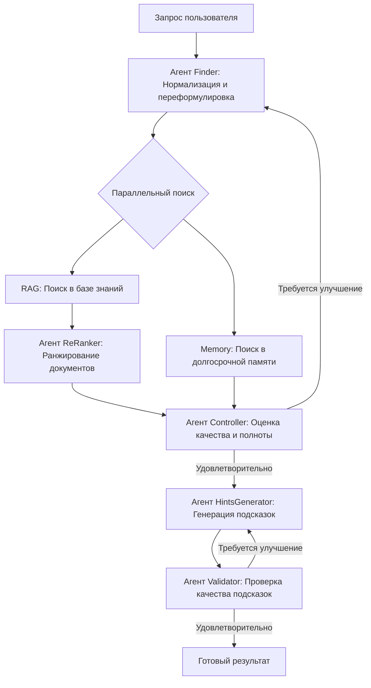
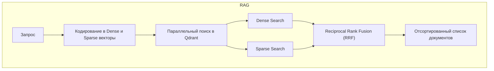
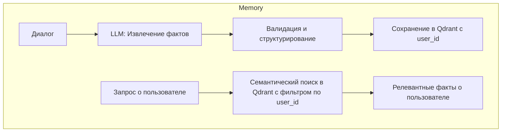

# Мультиагентная система подсказок для службы поддержки

Это мультиагентная система, предназначенная для предоставления операторам службы поддержки подсказок в режиме реального времени. Система анализирует запросы пользователей, извлекает релевантную информацию из базы знаний (RAG) и долгосрочной памяти (Memory), а затем генерирует конкретные рекомендации для оператора.

## Ключевые возможности

- **Подсказки в реальном времени**: Генерирует полезные советы для операторов во время диалога с клиентом.
- **Извлечение знаний**: Автоматически извлекает и проверяет факты из диалогов с помощью LLM для пополнения долгосрочной памяти.
- **Долгосрочная память**: Хранит профили пользователей и историю их взаимодействий для персонализированной и контекстно-зависимой поддержки.
- **Гибридный поиск**: Сочетает семантический (dense) и ключевой (sparse, BM25) поиск в Qdrant для максимальной точности поиска.
- **Итеративное улучшение**: Система автоматически переформулирует запросы и регенерирует подсказки, если их качество оказывается низким, благодаря внутреннему циклу валидации.
- **REST API**: Готовый к использованию эндпоинт FastAPI для легкой интеграции с внешними системами.
- **Многоуровневый контроль качества**: Проверяет результаты на каждом этапе обработки для обеспечения их релевантности и точности.

## Архитектура

Система построена на базе `LangGraph`, где несколько агентов последовательно и параллельно обрабатывают запрос пользователя для достижения наилучшего результата.

### Общий воркфлоу



### Система RAG (Retrieval-Augmented Generation)

RAG отвечает за поиск релевантной информации в базе знаний.



### Система долгосрочной памяти (Long-Term Memory)

Долгосрочная память хранит и извлекает факты о пользователях, накопленные из предыдущих диалогов.



## Установка и запуск

Подробные инструкции по установке, настройке окружения и запуску сервисов вынесены в отдельный документ: **[README_API_SERVICE.md](README_API_SERVICE.md)**.

## Структура проекта

```
agent_system/
├── agents/           # Агенты системы
│   ├── base_agent.py
│   ├── finder.py
│   ├── reranker.py
│   ├── controller.py
│   ├── hints_generator.py
│   └── validator.py
├── memory/           # Логика долгосрочной памяти
│   ├── memory_controller.py
│   └── promts.py
├── rag/              # Система RAG с гибридным поиском
│   ├── controller.py
│   └── fragments_creator.py
├── service/          # Утилиты для настройки Qdrant
│   └── qudrant_db_creator.py
├── source/           # Конфигурация и промпты
│   ├── config.py
│   └── prompts.py
├── utils/            # Утилиты логирования
│   └── logger.py
├── state.py          # Определения состояний и результатов
├── system.py         # Фасад системы с функциями маршрутизации
└── workflow.py       # Определение графа LangGraph

api/
└── api.py            # FastAPI сервер с эндпоинтом /assist

main.py               # Скрипт для тестирования API
requirements.txt      # Зависимости
README.md             # Эта документация
README_API_SERVICE.md # Инструкции по настройке сервисов
```

## Технические детали

- **Модель для эмбеддингов**: `sentence-transformers/xlm-r-100langs-bert-base-nli-stsb-mean-tokens` (768 измерений).
- **Векторная база данных**: Qdrant с гибридными коллекциями (dense + sparse).
- **LLM**: `google/gemma-3-12b-it` через OpenRouter (настраиваемо).
- **Алгоритм ранжирования**: Reciprocal Rank Fusion (RRF) для объединения результатов поиска.
